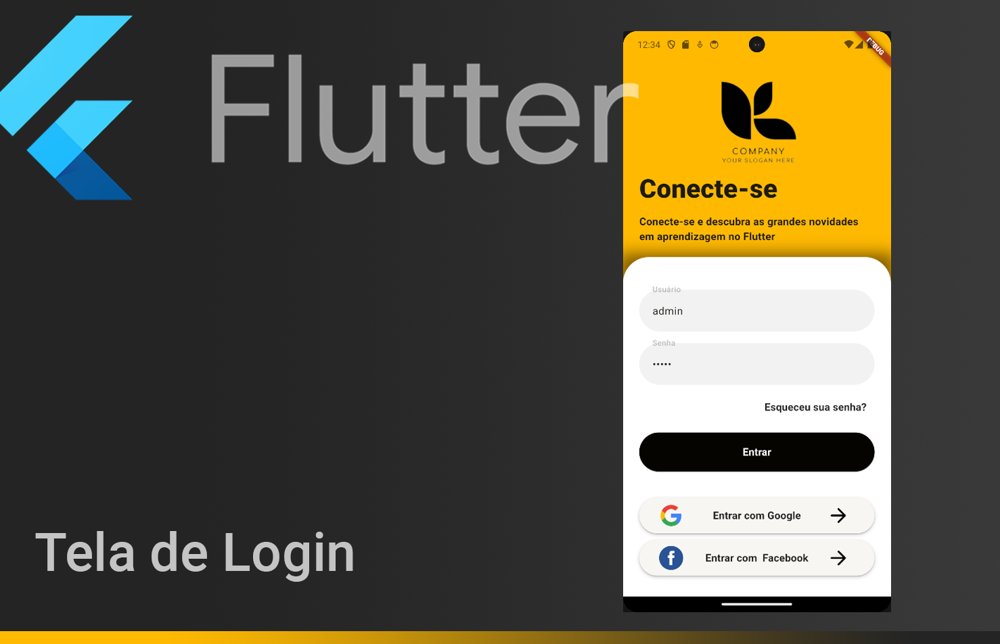

<!-- markdownlint-disable MD033 -->
<!-- markdownlint-disable MD041 -->

<br>
<div align="center">
  <a href="https://github.com/DaniloCalegaro">
    
  </a>
  
  
  
</div>
<br>
<div align="center">
  <a>
    
    
  <a/>
</div>

# Tela Login - Flutter

<div align="center">

[**Sobre o Projeto**](#sobre-o-projeto) &nbsp;&nbsp;&#124;&nbsp;&nbsp;
[**Tecnologias**](#tecnologias) &nbsp;&nbsp;&#124;&nbsp;&nbsp;
[**Layout**](#layout) &nbsp;&nbsp;&#124;&nbsp;&nbsp;
[**Pré Visualização**](#pré-visualização) &nbsp;&nbsp;&#124;&nbsp;&nbsp;
[**Configurações**](#configurações) &nbsp;&nbsp;&#124;&nbsp;&nbsp;
[**Licença**](#licença)&nbsp;&nbsp;&#124;&nbsp;&nbsp;
[**Autor**](#autor)

</div>

<p align="center">
  
</p>

## Sobre o Projeto

Aplicação de uma tela de login com os conceitos básicos, com foco para o aprendizado em Flutter e Dart.

## Tecnologias

<table>
  <tbody>
    <tr>
      <td style="font-weight: bold"><code>/mobile</code></td>
      <td>
        <a href="https://flutter.dev/" target="_blank" rel="noopener noreferrer"><code>Flutter</code></a> -
        <a href="https://dart.dev/" target="_blank" rel="noopener noreferrer"><code>Dart</code></a>
      </td>
    </tr>
  </tbody>
</table>

<br>

## Layout

Layout foi criado com elementos básicos para finalidade de exercitar os conceitos ensinados no curso, assim como:

- Stateless e StateFul
- Themes
- Scaffold
- Input
- Button
- Imagens
- Container
- SizeBox
- Alertas
- Alinhamento de componentes
- Personalização

## Pré Visualização

<p align="center">
  
</p>

## Configurações

### Requisitos

Necessário realizar as instalações:

- [`Git`](https://git-scm.com/)
- [`Flutter`](https://docs.flutter.dev/)
- [`Android Studio`](https://developer.android.com/studio)
- [`Visual Studio Code`](https://code.visualstudio.com/)

### Clonar repositório

```bash
# Execute o comando git clone para realizar o clone do repositório
$ git clone https://github.com/DaniloCalegaro/screen_login_flutter.git
# ou execute (necessário instalar Github CLI - https://cli.github.com/)
$ gh repo clone DaniloCalegaro/screen_login_flutter
# Entre na pasta do repositório clonado
$ cd screen_login_flutter
```

### Comandos importantes

```bash
## verificar se todas as dependências esta instaladas
$ flutter doctor
## analisar o código do projeto flutter
$ flutter analyze
```

## Licença

Esse projeto está registrado sob a licença MIT.

## Autor

Danilo Calegaro - [danilocalegaro.dev.br](https://danilocalegaro.dev.br/)

---